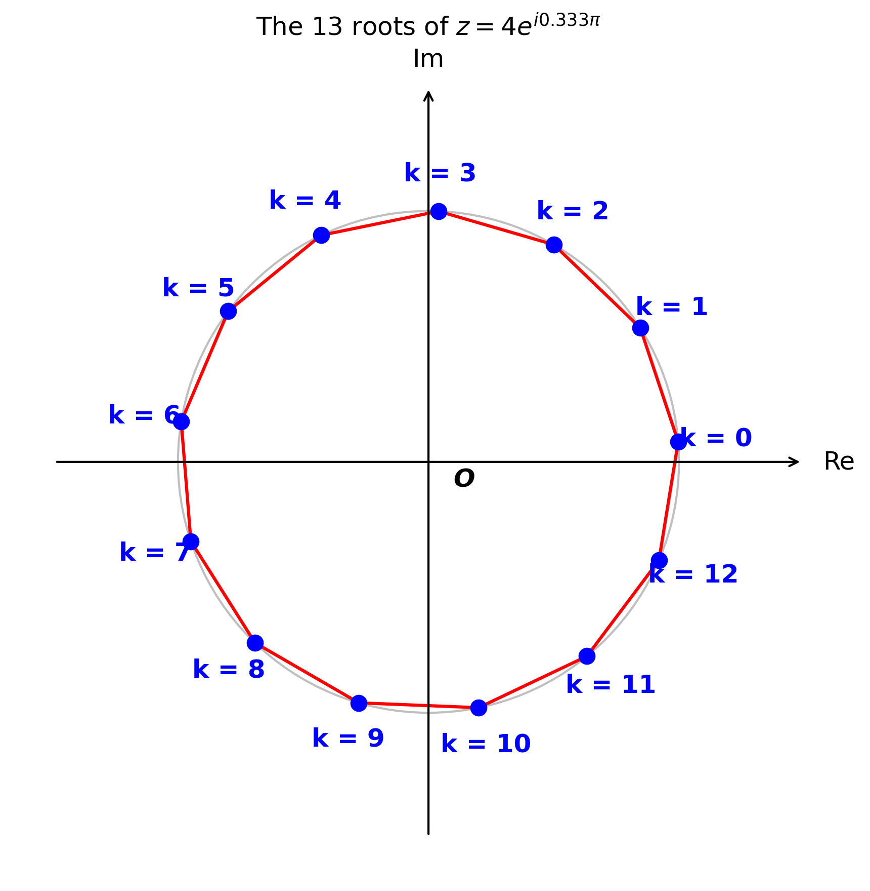

# Small program that generates an image that demonstrates the geometric property of complex roots of unity.

The *n*th roots of a complex number are equally spaced on a circle centered at the origin in the complex plane. They form the vertices of a regular n-gon (for cube roots, an equilateral triangle).

